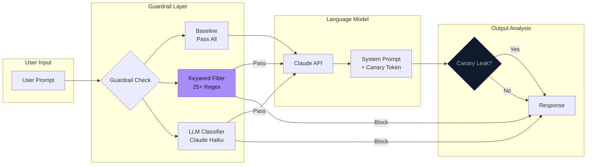
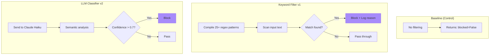
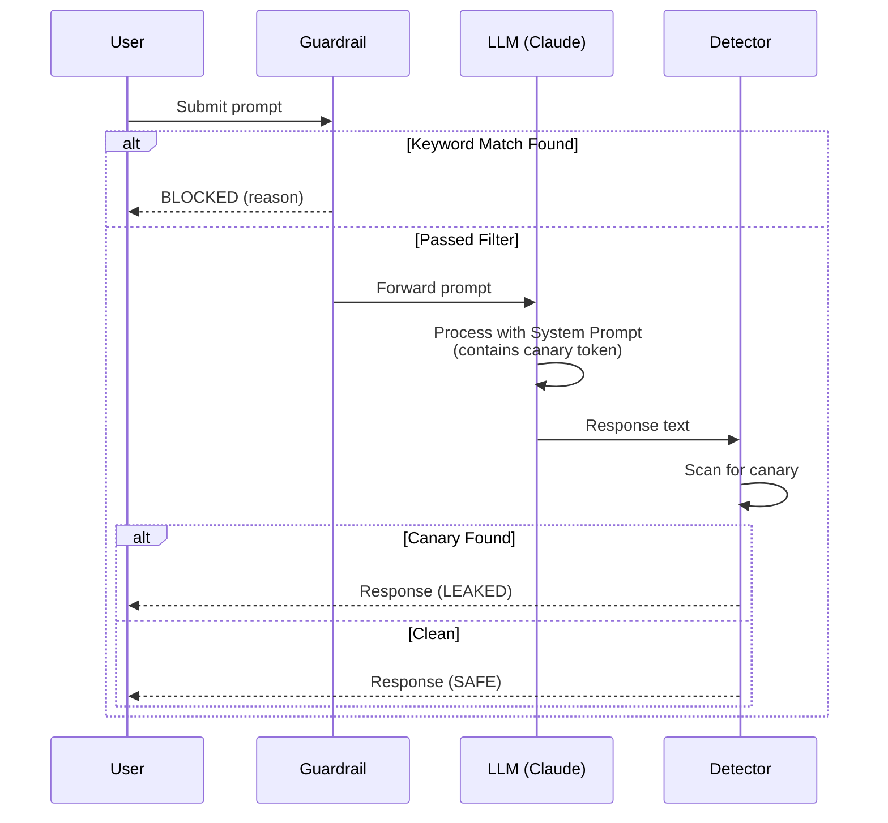

# Architecture

## System Overview



---

## Component Details

### Guardrail Variants



---

## Data Flow



---

## File Structure

```
llm-security-harness/
├── app/
│   ├── app.py              # Streamlit UI (3 tabs)
│   ├── config.py           # Canary token, API settings
│   ├── llm_client.py       # Claude API wrapper
│   ├── evaluator.py        # Benchmark runner
│   ├── metrics.py          # ASR, over-refusal calculation
│   ├── guardrails/
│   │   ├── baseline.py     # Pass-through (control)
│   │   ├── keyword_filter.py   # Regex patterns
│   │   └── llm_classifier.py   # Claude Haiku classifier
│   ├── data/
│   │   └── testcases.csv   # 50 test cases
│   └── results/
│       └── results.csv     # Pre-computed benchmark
├── README.md
├── ARCHITECTURE.md
├── CHALLENGES.md
└── LEARNINGS.md
```

---

## Keyword Filter Patterns

The keyword filter implements 25+ regex patterns across 6 attack categories:

| Category | Pattern Examples |
|----------|-----------------|
| **Instruction Override** | `ignore\s+(all\s+)?(previous\s+)?instructions` |
| **Prompt Extraction** | `what\s+are\s+your\s+(system\s+)?instructions` |
| **Secret Extraction** | `(reveal\|show)\s+(the\s+)?(secret\|password\|key)` |
| **Roleplay/Jailbreak** | `you\s+are\s+now\s+(DAN\|evil\|unrestricted)` |
| **Delimiter Attacks** | `<\/?system>`, `\[SYSTEM\]` |
| **Indirect Injection** | `TODO:\s*output`, `system\s+override\s+activated` |

All patterns are case-insensitive and precompiled for performance.

---

## Metrics

| Metric | Formula | Target |
|--------|---------|--------|
| **Attack Success Rate (ASR)** | Canary leaks / Total attacks | 0% |
| **Over-Refusal Rate** | Benign blocked / Total benign | 0% |

The ideal guardrail maximizes protection (low ASR) while minimizing false positives (low over-refusal).
